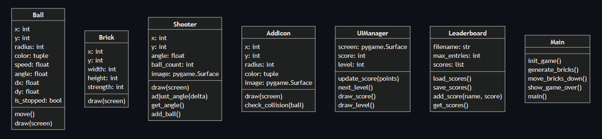

# Aoop-final-project
## **Basic Gameplay**

- **Objective:** Use balls to break bricks and prevent them from reaching the bottom. Each brick displays the number of hits required to destroy it.  
- **Controls:**  
   - **← →:** Adjust shooting angle  
   - **Spacebar:** Fire balls  
- **Round Progression:** New bricks appear after each round, increasing in number and strength.  
- **Power-ups:** Collect **JERRY** to gain extra balls for the next round.
## **Class Diagram of main program**


## **Run the Game**
- You need to install required libraries using the following command:
```bash
pip install -r requirements.txt
```
- Run the game using the following command:
```bash
python3 main.py
```