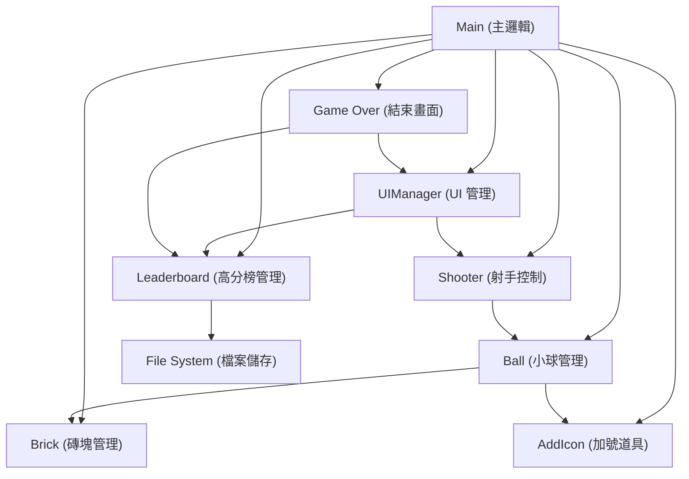

```mermaid
graph TD
    %% 遊戲架構總覽

    Main["Main (主邏輯)"] --> Shooter["Shooter (射手控制)"]
    Main --> Ball["Ball (小球管理)"]
    Main --> Brick["Brick (磚塊管理)"]
    Main --> AddIcon["AddIcon (加號道具)"]
    Main --> UIManager["UIManager (UI 管理)"]
    Main --> Leaderboard["Leaderboard (高分榜管理)"]
    Main --> GameOver["Game Over (結束畫面)"]

    Shooter --> Ball
    Ball --> Brick
    Ball --> AddIcon
    UIManager --> Shooter
    UIManager --> Leaderboard
    Leaderboard --> FileSystem["File System (檔案儲存)"]

    GameOver --> Leaderboard
    GameOver --> UIManager
```