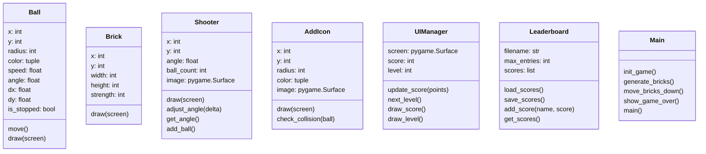

```mermaid
classDiagram

    %% 🎮 類別圖：遊戲類別結構

    %% 🎯 Ball 類別
    class Ball {
        x: int
        y: int
        radius: int
        color: tuple
        speed: float
        angle: float
        dx: float
        dy: float
        is_stopped: bool
        move()
        draw(screen)
    }

    %% 🎯 Brick 類別
    class Brick {
        x: int
        y: int
        width: int
        height: int
        strength: int
        draw(screen)
    }

    %% 🎯 Shooter 類別
    class Shooter {
        x: int
        y: int
        angle: float
        ball_count: int
        image: pygame.Surface
        draw(screen)
        adjust_angle(delta)
        get_angle()
        add_ball()
    }

    %% 🎯 AddIcon 類別
    class AddIcon {
        x: int
        y: int
        radius: int
        color: tuple
        image: pygame.Surface
        draw(screen)
        check_collision(ball)
    }

    %% 🎯 UIManager 類別
    class UIManager {
        screen: pygame.Surface
        score: int
        level: int
        update_score(points)
        next_level()
        draw_score()
        draw_level()
    }

    %% 🎯 Leaderboard 類別
    class Leaderboard {
        filename: str
        max_entries: int
        scores: list
        load_scores()
        save_scores()
        add_score(name, score)
        get_scores()
    }

    %% 🎯 Main 類別 (遊戲主邏輯)
    class Main {
        init_game()
        generate_bricks()
        move_bricks_down()
        show_game_over()
        main()
    }

    %% 📊 類別關係
    %%Shooter --> Ball : Creates
    %%Ball --> Brick : Collides
    %%Ball --> AddIcon : Collides
    %%UIManager --> Shooter : %%Controls
    %%UIManager --> Score : Manages
    %%Leaderboard --> UIManager : %%Displays
    %%Main --> Shooter : Manages
    %%Main --> Brick : Generates
    %%Main --> AddIcon : Generates
```