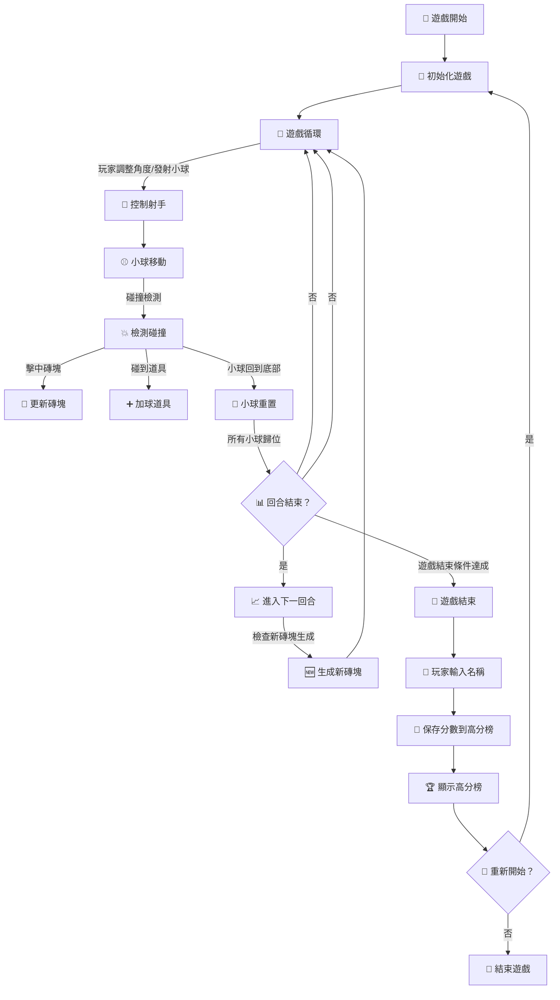

```mermaid
flowchart TD
    Start["🚀 遊戲開始"] --> Init["🔧 初始化遊戲"]
    Init --> GameLoop["🔄 遊戲循環"]
    
    GameLoop -->|玩家調整角度/發射小球| ShooterControl["🎯 控制射手"]
    ShooterControl --> BallMove["⚾ 小球移動"]
    BallMove -->|碰撞檢測| CheckCollision["💥 檢測碰撞"]
    CheckCollision -->|擊中磚塊| BrickUpdate["🧱 更新磚塊"]
    CheckCollision -->|碰到道具| AddIconUpdate["➕ 加球道具"]
    CheckCollision -->|小球回到底部| BallReset["🔄 小球重置"]
    
    BallReset -->|所有小球歸位| NextRoundCheck{"📊 回合結束？"}
    NextRoundCheck -->|是| NextLevel["📈 進入下一回合"]
    NextRoundCheck -->|否| GameLoop

    NextLevel -->|檢查新磚塊生成| GenerateBricks["🆕 生成新磚塊"]
    GenerateBricks --> GameLoop

    NextRoundCheck -->|否| GameLoop

    NextRoundCheck -->|遊戲結束條件達成| GameOver["🏁 遊戲結束"]
    GameOver --> EnterName["📝 玩家輸入名稱"]
    EnterName --> SaveScore["💾 保存分數到高分榜"]
    SaveScore --> ShowLeaderboard["🏆 顯示高分榜"]
    ShowLeaderboard --> Choice{"🔄 重新開始？"}

    Choice -->|是| Init
    Choice -->|否| End["🛑 結束遊戲"]
```